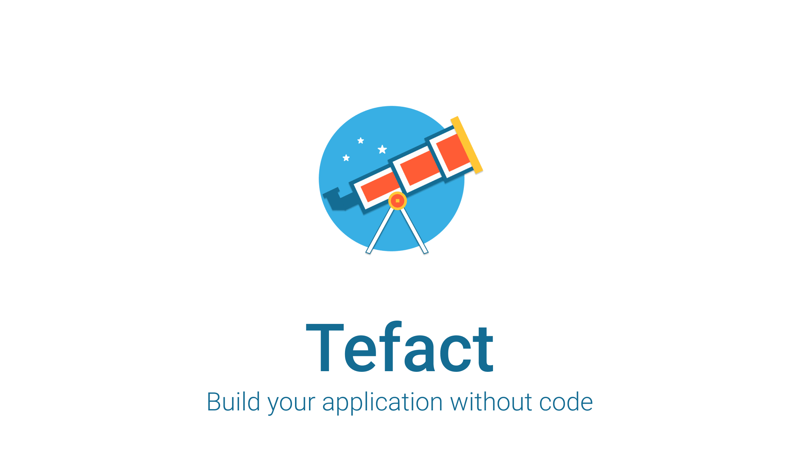

<div align="center">
  
</div>
<div align="center">
  <a href="https://staringos.com">网站</a> | 
  <a href="http://saas.staringos.com">案例</a> | 
  <a href="https://staringos.com/docs">文档</a> | 
  <a href="https://staringos.com/docs/join-us">社区</a> | 
  <a href="https://staringos.com/docs/join-us">支持</a> |
  <a href="./README.md">English Docs</a>
</div>

<br />

<div align="center">

[](https://github.com/Tefact/tefact-saas)
[](https://github.com/tefact/tefact-saas/actions)
[](https://github.com/Tefact/tefact-saas/releases)
[](https://github.com/Tefact/tefact-saas/pulls)
[](https://lgtm.com/projects/g/Tefact/tefact-saas/alerts/)

</div>

# Tefact Engine [](https://discord.gg/7V5vnHW2)

开源无代码编辑器，使用图形化界面生成 网站、H5和表单.

## Getting Start

安装依赖

```shell script
yarn add @tefact/editor
```

引入样式文件

```ts
import "@tefact/editor/lib/index.css"
```

引入并使用编辑器组件.

```vue
<template>
  <Editor
    :value="target"
    :editorSetting="editorSetting"
  ></Editor>
</template>
<script lang="ts">
import Vue from "vue";
import Editor, { getDefaultFeature } from "@tefact/editor";

export default Vue.extends({
  data() {
    return {
      target: getDefaultFeature("page"),
      editorSetting: {}
    }
  },
  components: {
    Editor
  }
})
</script>
```

## 核心概念

### Target

Target 是你所编辑和存储的对象，可以是一个网页、H5或者表单. 他是一套JSON数据结构描述展示内容、样式和使用数据。

您可以使用 `@tefact/editor` 中的 `getDefaultFeature` 去生成默认的 Target 数据。编辑器经过编辑后，会修改对应的数据，您所需要做的就是把它保存起来，供下次调用使用。每个 Target 都有一个 featureType 属性，标识当前 Target 的类型。将 Target 可以引入 `@tefact/feature-form` 或 `@tefact/feature-page` 中，可以展示其内容。

### Editor

`@tefact/editor` 是一个界面编辑器，用来提供给用户编辑 Target 的展示内容和样式信息

#### 参数

- value: 正在编辑的 Target 对象
- editorSetting: 编辑器设置

#### Event

- editTarget: 当 Target 被修改后调用
- share: 当分享按钮被点击时调用
- save: 当保存按钮被点击时调用
- back: 返回按钮被点击时调用

### Page 页面

`@tefact/feature-page` 是一个查看组件，用来查看 `featureType = page` 的 `target` 对象. 使用案例:

```vue
<template>
  <Page :value="target"></Page>
</template>
<script lang="ts">
import Vue from "vue";
import Page, { DFFAULT } from "@tefact/feature-page";

export default Vue.extends({
  data() {
    return {
      target: DFFAULT
    }
  },
  components: {
    Page
  }
})
</script>
```

### Form 表单

与 `page` 一样, `@tefact/feature-form` 也是一个预览组件，用来查看或预览 `featureType = form` 的 Target, 您可以:

```vue
<template>
  <Form :value="target"></Form>
</template>
<script lang="ts">
import Vue from "vue";
import Form, { DFFAULT } from "@tefact/feature-page";

export default Vue.extends({
  data() {
    return {
      target: DFFAULT
    }
  },
  components: {
    Form
  }
})
</script>
```

### 加入社区


## 贡献代码

[CONTRIBUTING](./CONTRIBUTING.md)

#### Discord

[](https://discord.gg/7V5vnHW2)
