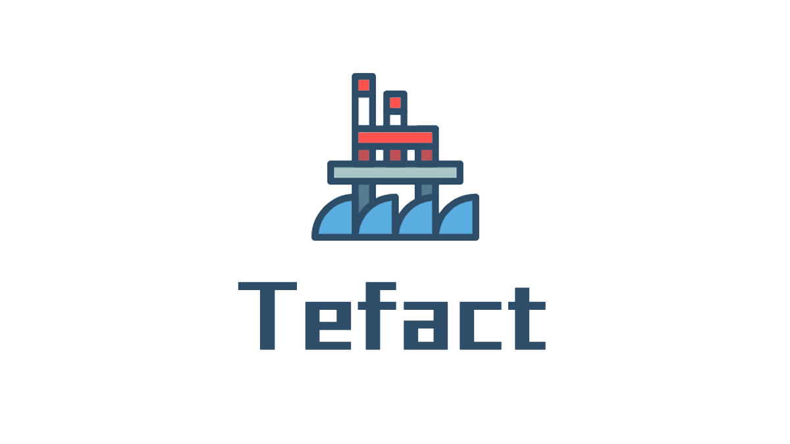
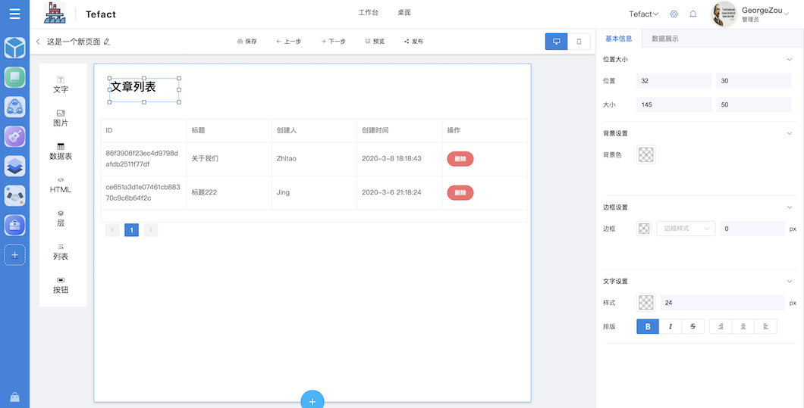
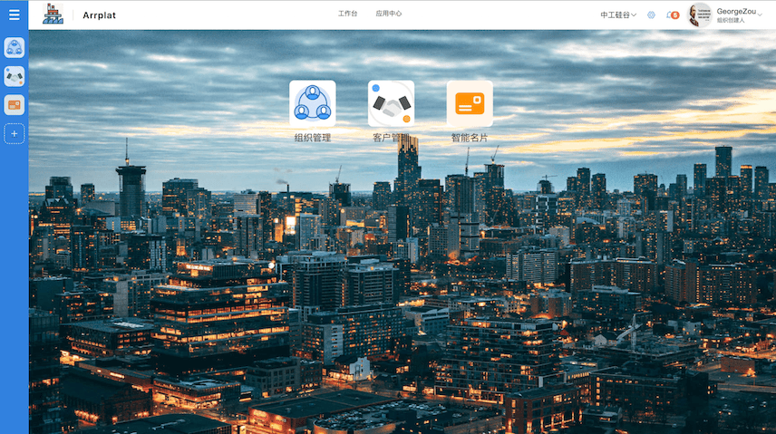
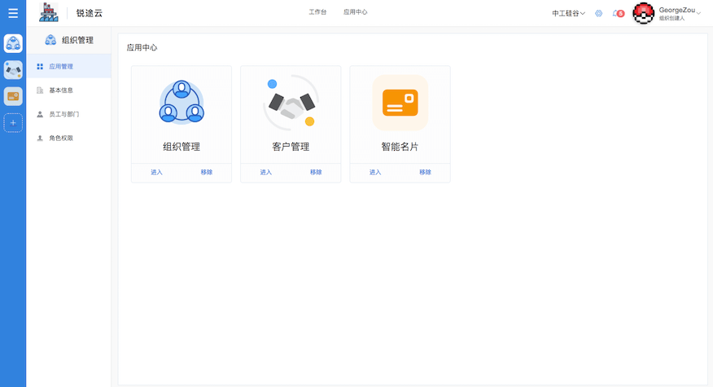
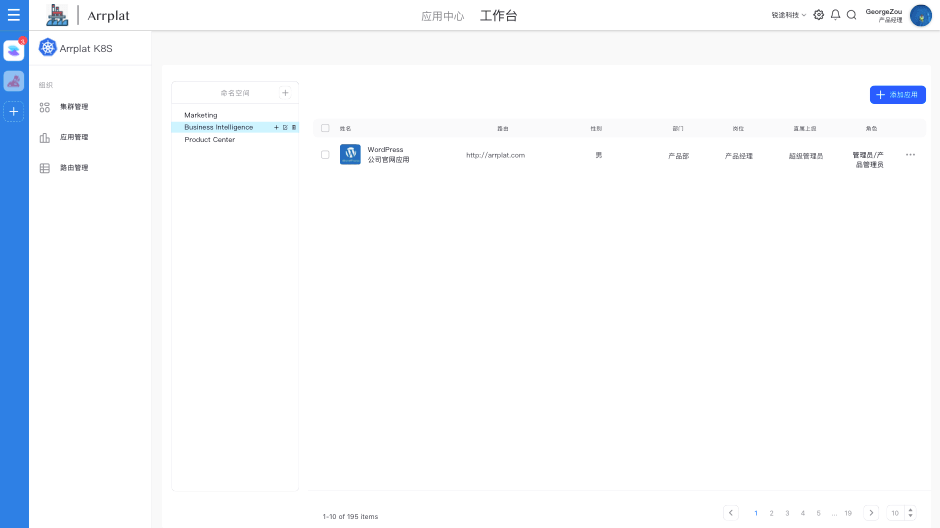

  

  <a href="https://tefact.com">官网</a> | 
  <a href="https://saas.tefact.com">立即使用</a> | 
  <a href="https://tefact.com/docs">文档</a> | 
  <a href="https://tefact.com/docs/join-us">社区</a> | 
  <a href="https://tefact.com/docs/join-us">技术支持</a>

 

  
  
  
  
  

# Tefact 低代码平台

让你通过无需任何代码即可生成H5页面、表单及管理后台。

Build your application without code!

[点击查看DEMO](http://saas.tefact.com)

#### 自定义丰富的企业应用

#### 更方便的在您的K8S集群中部署Docker镜像

#### Front End

- NodeJS = 12.2.0
- Lerna
- Typescript
- Vue
- Nuxt
- Python >3.6
- [Flask](https://www.palletsprojects.com/p/flask/): Web Framework
- [SQLAlchemy](https://github.com/pallets/flask-sqlalchemy): ORM Framework
- [FlaskMigrate](https://github.com/miguelgrinberg/Flask-Migrate): Database migrations
- Redis
- Mysql >5.6
- Docker
- Kubernetes

## Getting Start

[查看文档](https://tefact.com/docs/getting-start)

## 获取技术支持

关注 `真科技Tefact` 微信公众号，回复 `技术支持` 加入微信群，获取 1v1 人工技术支持.

## Contributing

[CONTRIBUTING](./CONTRIBUTING.md)
