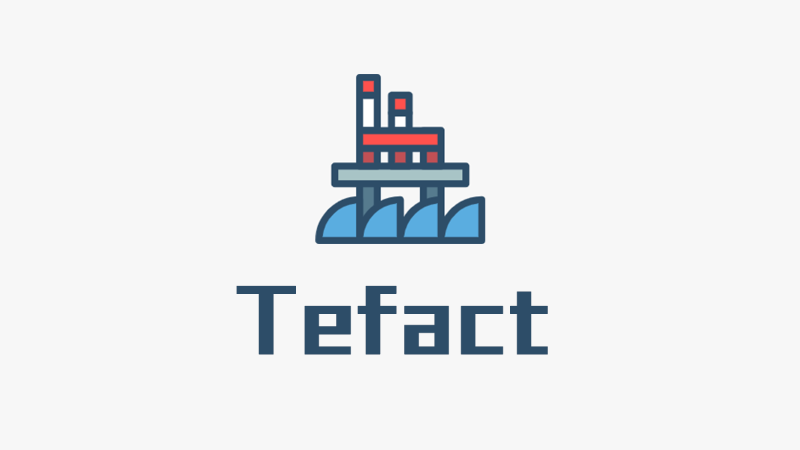
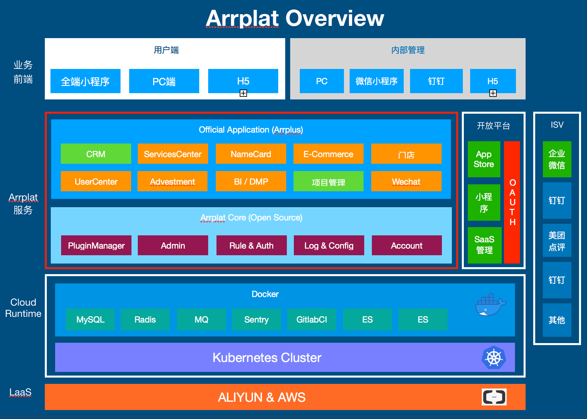

<div align="center">
  
</div>

<div align="center">
[](https://github.com/Tefact/tefact-saas)
[](https://github.com/Tefact/tefact-saas/releases)
[](https://github.com/Tefact/tefact-saas/pulls)
</div>

让你通过无需任何代码即可生成简单CRUD后台，方便的管理您的应用、页面、数据源、工作流 
Build your admin panel without code!


[点击查看DEMO](http://saas.tefact.com)


#### 自定义丰富的企业应用


#### 更方便的在您的K8S集群中部署Docker镜像


## Tech Stack



#### Front End

- NodeJS = 12.2.0
- Lerna
- Typescript
- Vue
- Nuxt
- Python >3.6
- [Flask](https://www.palletsprojects.com/p/flask/): Web Framework
- [SQLAlchemy](https://github.com/pallets/flask-sqlalchemy): ORM Framework
- [FlaskMigrate](https://github.com/miguelgrinberg/Flask-Migrate): Database migrations
- Redis
- Mysql >5.6
- Docker
- Kubernetes

## Getting Start

### Config your application

Copy `config.example.py` as `config.py` and change database and redis configuration in it.

### Docker启动 Run In Docker

Build Docker Image

```shell script
docker build -t arrplat .
```

Run it

```shell script
docker run -it -p 5000:5000 --name arrplat-run -d Tefact
```

### 手动启动 Run Manually

**!! NodeJS = 12.2.0 !!**

Install Dependencies

```
cd admin
RUN npm config set unsafe-perm true
npm install
npm run generate
```

Install server requirements

```
cd ../
pip install -r requirements.txt
```

Start server

```
python main.py
```

Start admin panel

```
yarn run dev
```

goto your bower: http://localhost:8800/

## 初始化数据库 Init Database (If a new server)

Generate an initial migration:

```bash
python manage.py db migrate
```

Then you can apply the migration to the database:

```bash
python manage.py db upgrade
```

Init Plugin Config

```bash
./bin/startup.sh
```

Init product structure data

```bash
python manage.py init-data
```
